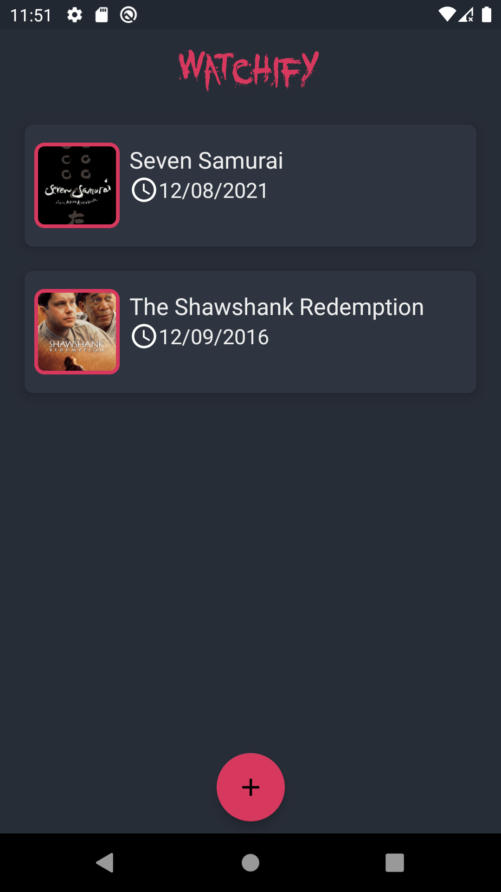
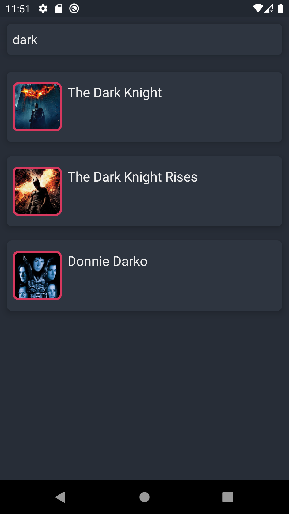
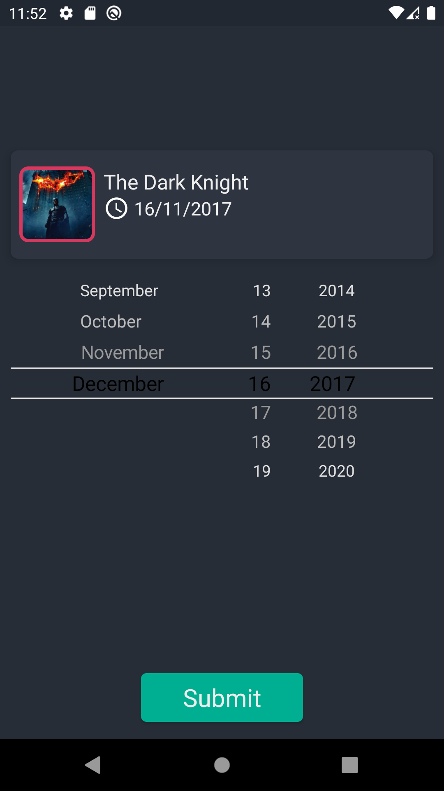

# 🍿 Watchify 

a very simple android application using manual dependency injection for providing objects, user can save the movies that watched before and set a date for them

## 📱 Screenshots

| Main Screen 🌕 | Search Screen 🌕 | Pick Date Screen 🌕 |
| ---- | ---- | ---- |
|  |  |  | 

## ✨ Details

movie search using this [Movie API](http://moviesapi.ir/) for providing a list of movies when user search

## 📄 Licence
```
Copyright (c) 2021 Sina Dalvand

Licensed under the Apache License, Version 2.0 (the "License");
you may not use this file except in compliance with the License.
You may obtain a copy of the License at

http://www.apache.org/licenses/LICENSE-2.0

Unless required by applicable law or agreed to in writing, software
distributed under the License is distributed on an "AS IS" BASIS,
WITHOUT WARRANTIES OR CONDITIONS OF ANY KIND, either express or implied.
See the License for the specific language governing permissions and
limitations under the License.
```
